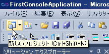
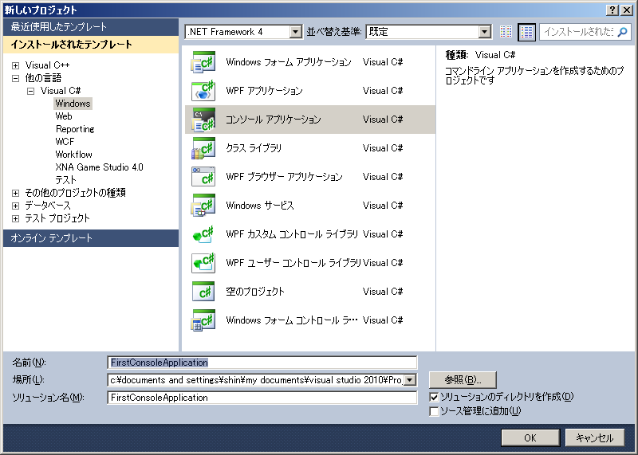
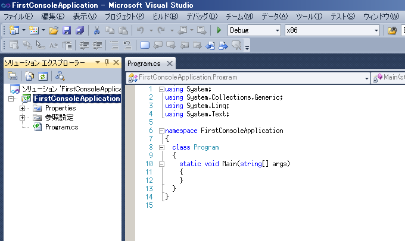
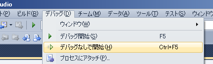
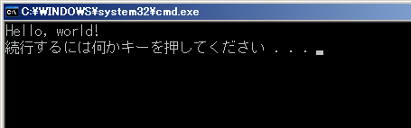

# C#プログラミング講習会

## 1. プログラミングを始める

### 新しいプロジェクトを作る

Visual Studio でのプログラミングは**プロジェクト**を単位として行われます。

まずはツールバーの**「新しいプロジェクト」**ボタンを押しましょう。

以下のようなウインドウが表示されるので左側のツリーで**「Visual C#」**の**「Windows」**を選択、右側のリストから**「コンソール アプリケーション」**を選択し、プロジェクトの**「名前」**を適当に決めましょう（ここでは「FirstConsoleApplication」）。

OKを押すと以下のようにプロジェクトが生成されコード（Program.cs ファイルの中身）が表示されます。

Program.cs ファイルになにやらごちゃごちゃと書き込まれていますが**全部消して空にしてしまいましょう。**

### とりあえず丸写ししてみる

早速以下のコードを打ち込んでみましょう。
そして、**Visual Studioの強力な自動補完機能（IntelliSense）の便利さを実感して下さい。**例えば最初のclを入力しただけでclassという候補が選択された状態で表示されます（その状態でEnterを押すと確定され入力されます）。

<pre class="code"><code>class Program
{
  static void Main()
  {
    System.Console.WriteLine("Hello, world!");
  }
}
</code></pre>

コードを入力するときは以下のことに注意してください。
<ul><li>**大文字・小文字を間違えない**（特に、Mainをmainと書かないように）</li><li>**括弧・ダブルクォーテーションを閉じ忘れない**</li><li>`System.Console.WriteLine("Hello, world!");`の最後の**セミコロンを忘れない**</li>
</ul>

特に**セミコロン**は忘れやすいので注意してください。セミコロンは**文と文とを明確に区別する句点**の働きをしているので忘れると動作しなくなります（まあ忘れてもVisual Studioが赤ペン先生の如く赤波線で教えてくれるので大丈夫ですけど）。

### とりあえず実行してみる

**メニューバーの「デバッグ」→「デバッグなしで開始」**を選択（または**Ctrl+F5**を入力）し、
このプログラムを実際に**実行**してみましょう（「デバッグ開始」だと画面がすぐに消えてしまいます）。

うまく行けば、次のような画面（**コンソール画面**）が表示されます。

**<ruby>Congratulation!<rp>（</rp><rt>コングラッチュレーション</rt><rp>）</rp>　Congratulation!<rp>（</rp><rt>コングラッチュレーション</rt><rp>）</rp></ruby>** おめでとう……！　おめでとう……！　実行おめでとう……！

コードの意味はよく分からないけれど、とりあえず実行させることはできたはずです。できていない場合は、もう一度上のコードと比較してみて下さい。

### で、結局このコードは何をやっているのか

さて、このコードで最も重要なのは**`System.Console.WriteLine("Hello, world!");`**の部分です。
逆に言うと、他の部分は現時点で全く気にする必要が無く、**「なんたらMainの直後の中括弧の内側に Hello, world! を表示させるコードがあるな」**という認識で良いです。
問題のSystem.Console.WriteLineですが、英語の部分は適当に助詞を補って逐語訳すれば意味は大体理解できるはずです。**「システム (System) のコンソール (Console) に1行 (Line) 書け (Write)」**という感じになるんじゃないですか（適当）。

「書け」なんて命令するからには何を書かせたいのか教える必要があるので、その後の丸括弧の中には書かせたい文字列を入れておきます。**文字列はダブルクオーテーションで囲む必要があります（重要）。**囲まないとそれが文字列だとコンピュータが判断できないのです。

2つの文字列を表示させたければ、単純に以下のようにすればOKです。

<pre class="code"><code>class Program
{
  static void Main()
  {
    System.Console.WriteLine("A");
    System.Console.WriteLine("B");
  }
}
</code></pre>

ちなみに、System.Console.WriteLineをもっと速く入力する方法があります。**<kbd>cw</kbd>**と打ってTabキーを2回押してみましょう。

### 無視されるもの

空白文字（半角スペース・タブ・改行）はプログラムの実行に影響を与えない物として無視されるので、例えば以下のように書いても実行されます。

<pre class="code"><code>class Program{

  static void Main() {
System.Console.WriteLine("A");System.Console.WriteLine("B");
}}
</code></pre>

これは極端な例で、こんな風に書いてもただ読み辛いだけなのできちんとインデントして書きましょう。
また、意味のある語句（System, Console, WriteLineなどの単語、"Hello, world!"などの文字列）の途中で改行するとエラーになります。

### コメント

**`//`から行末まで**と**`/* ～ */`で囲まれた部分**は無視されます（**コメント**と呼びます）。

<pre class="code"><code>class Program
{
  static void Main()
  {
    // System.Console.WriteLine("A");
    System.Console.WriteLine("B");
    /*
    System.Console.WriteLine("C");
    System.Console.WriteLine("D");
    */
  }
}
</code></pre>

コメントはその名の通りコードの意味についてコメントしたり、一時的にコードを実行しないようにしたりする為に使われます。

### 演習：自己紹介プログラム

System.Console.WriteLineを使ってコンソール画面に自分の名前を表示させてみましょう。
