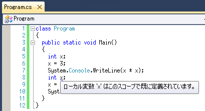
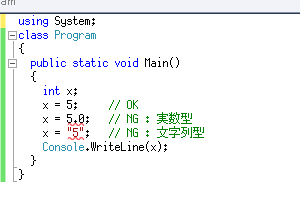

# C#プログラミング講習会

## 2. コンピュータに様々な計算をさせる

### 演算子とは

コンピュータ＝電子計算機ですからやはり計算をさせなければ。

System.Console.WriteLineは大変優秀なので文字列だけでなく計算結果の数値も表示してくれます。以下のコードを打ち込んで実行してみましょう。

加減乗除（＋, －, ×, ÷）はそれぞれ**`+ - * /`**という記号で表されます。
また、**`%`**は剰余を求める記号です。こういった記号をプログラミングにおいては**演算子**と呼びます。
演算子には多くの種類があります（演算子は数学的なものだけとは限りません。実は、`System.Console.WriteLine`の . もドット演算子という演算子だったりします）。

演算子には「`1 + 2 * 3 - 4`では`2 * 3`を一番先に計算せよ」というような結合の優先順位があります。
この場合、「`*`は`+, -`より優先順位が高い」と言います。
演算の順番は小括弧を使って変えることができます（中括弧や大括弧ではダメ）。

<pre class="code"><code>class Program
{
  static void Main()
  {
    System.Console.WriteLine(<strong>1 + 2 * 3 - 4</strong>);
    System.Console.WriteLine(<strong>(1 + 2) * (3 - 4)</strong>);
    System.Console.WriteLine(<strong>4 / 2</strong>);
    System.Console.WriteLine(<strong>5 % 3</strong>);
  }
}
</code></pre>

実行結果と式を見比べてみましょう。結果に納得できましたか？

### 割り切れない結果

次に、以下のコードを実行してみましょう。

<pre class="code"><code>class Program
{
  static void Main()
  {
    System.Console.WriteLine(<strong>5 / 2</strong>);
    System.Console.WriteLine(<strong>5.0 / 2</strong>);
    System.Console.WriteLine(<strong>5 / 2.0</strong>);
    System.Console.WriteLine(<strong>5.0 / 2.0</strong>);
  }
}
</code></pre>

結果はどうなりましたか？

C#では整数と実数（浮動小数点数）が明確に区別されます。**小数点を書くとその数は実数として扱われます**（他にも実数として扱わせる方法はいくつかあります）。**整数同士を除算すると結果は整数**になります。**実数が絡む除算をすると結果は実数**になります。

### 変数を使う（整数編）

まずは、以下のコードを打ち込んで実行してみましょう。

<pre class="code"><code>class Program
{
  static void Main()
  {
    <strong>int x;</strong>
    <strong>x = 3;</strong>
    System.Console.WriteLine(<strong>x</strong>);
  }
}
</code></pre>

`int x;`に目を瞑れば、やっていることが分かるのではないかと思います。つまり、<var>x</var>が3だから、画面に変数の中身である3が表示されているのです。**=**は**代入演算子**という名前で、**左辺の変数に右辺の値を代入する**という意味です。

例えば、以下の結果はどうなるでしょうか。

<pre class="code"><code>class Program
{
  static void Main()
  {
    int x;
    x = 3;
    <strong>x = x + 2;</strong>
    System.Console.WriteLine(x);
  }
}
</code></pre>

注意してほしいのは、`=`は単に左辺の変数に右辺の値を代入するだけの演算子であるということ。
演算子には結合の優先順位がありましたが、= の優先順位は + より低いので`x + 2`がまず実行されます。
この時点での<var>x</var>の値は3なので、<var>x</var>には3 + 2の結果である5が代入されます。

さて、問題の`int x;`ですが、これは変数を使う時に必要な**宣言**です。
intはinteger（整数）の略であり、**整数型変数**の宣言を表しています。`int x;`は**「整数型変数`x`をこれから使います」**という宣言です。
変数名は以下の条件を満たせば自分の好きなものを付けられます。
<ul><li>**半角英数字 (a-z, A-Z, 0-9)**または**アンダーバー (_)**で構成されている</li><li>先頭の文字が数字ではない</li><li>予約語（class, static, void, intなど、予め意味が決められている単語）ではない</li>
</ul>

本当は日本語変数名も付けられるはずですが逆に面倒になるのでやめておきましょう（IntelliSenseが働かなくなる、そもそも入力切替が面倒などの理由で）。

同じ名前の変数の宣言は1度しかできません。2度宣言しようとするとVisual Studioに怒られます。変数への代入は何度でもできます。

`int`は整数型と決まっているので、実数や文字列を入れようとするとこれまたVisual Studioに怒られます。

`int x; x = 3;`をまとめて**`int x = 3;`**と書くことができます。
以降この書き方を使っていきます。

### 変数を使う（実数編）

整数型変数があるということは、実数（浮動小数点数）型変数もあるはずです。
実数型変数の宣言には**double**というキーワードを使います
（何故doubleかというと、正式名称が「**倍**精度浮動小数点数型変数」だからです）。

<pre class="code"><code>class Program
{
  static void Main()
  {
    <strong>double</strong> r = 3.0;
    <strong>double</strong> pi = 3.14159265;
    <strong>System.Console.Write</strong>("円周長：");
    System.Console.WriteLine(2 * pi * r);
    <strong>System.Console.Write</strong>("面積：");
    System.Console.WriteLine(pi * r * r);
  }
}
</code></pre>

**`System.Console.Write`**は文字列を表示した後の改行を行いません（WriteLineと比較してみましょう）。

### 変数を使う（文字列編）

数値だけでなく文字列も変数に格納することができます。文字列型変数の宣言には**string**というキーワードを用います。

<pre class="code"><code>class Program
{
  static void Main()
  {
    <strong>string</strong> s = "world";
    System.Console.WriteLine(<strong>"Hello, " + s + "!"</strong>);
  }
}
</code></pre>

ここでの**+**は**文字列の連結**を表しています。

文字列と数値を連結しようとすると数値は文字列に自動変換され結果は文字列になります。
以下のコードの実行結果を確かめてみてください。

<pre class="code"><code>class Program
{
  static void Main()
  {
    System.Console.WriteLine("Hello, " + 1 + 1 + "!");
    System.Console.WriteLine("Hello, " + (1 + 1) + "!");
  }
}
</code></pre>

### 演習：自己紹介プログラム・改

整数型変数<var>year</var>に入学年度、文字列型変数<var>name</var>に自分の名前を入れ、
その2つの変数を使って「○○年入学の○○です。」と表示しましょう。
また`year + 4`（新入生の場合）を使って「○○年に卒業予定です。」とも表示しましょう。

### [こぼれ話](javascript:showKobore();)

int 型やdouble 型は表せる数値の範囲が決まっています。
C#にはintやdoubleの他にも異なる値の範囲をもつ多数の型が用意されており、必要に応じてそれを使うことができます。
<table><tr><th></th><th>名称</th><th>サイズ</th><th>最小値</th><th>最大値</th><th>絶対値での最小値</th></tr><tr><th rowspan="3">整数型</th><th>byte</th><td>1 バイト</td><td>0</td><td>255</td><td></td></tr><tr><th>int</th><td>4 バイト</td><td>-2147483648</td><td>2147483647</td><td></td></tr><tr><th>long</th><td>8 バイト</td><td>-9223372036854775808</td><td>9223372036854775807</td><td></td></tr><tr><th rowspan="3">浮動小数点型</th><th>float</th><td>4 バイト</td><td>約-3.40×1038</td><td>約3.40×1038</td><td>約1.40×10-45</td></tr><tr><th>double</th><td>8 バイト</td><td>約-1.80×10308</td><td>約1.80×10308</td><td>約4.94×10-324</td></tr></table>
整数値を使う時には、`0x`で始まる16進数表記を用いることができます。

float 型の変数に代入するときは、数値の後ろに`f`を付けなければいけません。

浮動小数点数型を使うときには、`3e8`(＝3×108),`1.6e-19`(＝1.6×10-19) のような科学表記を使うことができます。

<pre class="code"><code>class Program
{
  static void Main()
  {
    byte b = 0xff;
    float f = 0.9f;
    double d = 3e8;

    System.Console.WriteLine(b);
    System.Console.WriteLine(f);
    System.Console.WriteLine(d);
  }
}
</code></pre>

詳しくは[組込み型 (C# によるプログラミング入門)](http://ufcpp.net/study/csharp/st_embeddedtype.html)を参照してください。

